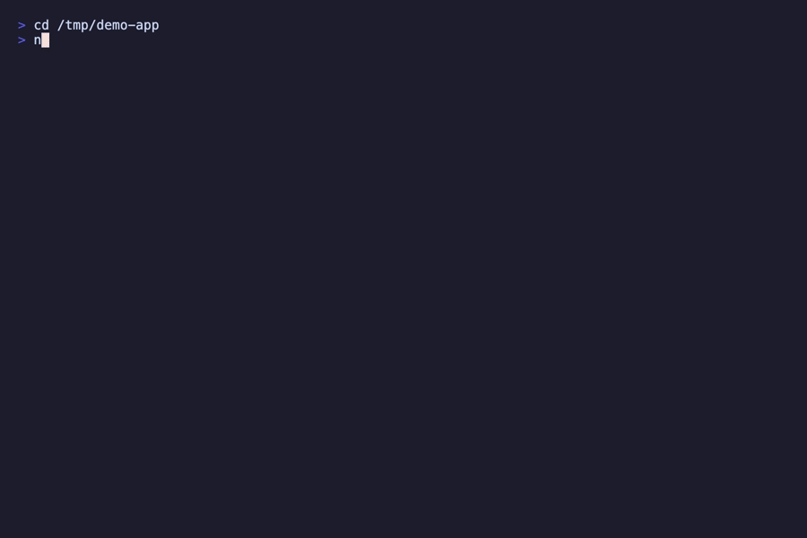

<div align="center">

# agents-sync

**Make your AGENTS.md actually read by Claude Code — and keep every other AI tool in sync automatically.**

**11 AI tools · auto-loaded in every session · zero-cost template mode · ~$0.03–0.06 per AI sync**

[](https://www.npmjs.com/package/@googlarz/agents-sync)
[](LICENSE)
[](https://nodejs.org)


[](https://claude.ai/code)
[](https://cursor.com)
[](https://github.com/openai/codex)
[](https://opencode.ai)
[](https://kiro.dev)
[](https://trae.ai)

<br/>



</div>

---

## The Problem

You migrated from Prisma to Drizzle three weeks ago. You updated `CLAUDE.md`. Last Thursday, your colleague opened the project in Cursor — `.cursorrules` still said "use Prisma ORM". They wrote a new migration using Prisma. The PR landed on Friday. You found it Monday morning.

You moved auth to a separate `src/auth/` module two sprints ago. The directory restructure is in git. Every AI tool still thinks auth lives in `src/lib/`. New engineers onboard, get confidently wrong suggestions on day one, and blame themselves for not understanding the codebase.

You added a "never use `any` type" rule to `CLAUDE.md` in January. It's May. Copilot never heard about it. Windsurf never heard about it. The rule exists in one file, enforced by one tool, ignored by everything else.

Each of these happened because context files drift. Not dramatically — just one update here, one forgotten file there, until the gap between what you wrote and what your tools know is wide enough to cause real damage.

Every AI coding tool expects its own context file:

| Tool | File |
|---|---|
| Claude Code | `CLAUDE.md` |
| Cursor | `.cursorrules` |
| GitHub Copilot | `.github/copilot-instructions.md` |
| Codex / opencode / Amp | `AGENTS.md` |
| Gemini CLI | `GEMINI.md` |
| Windsurf | `.windsurfrules` |
| Cline | `.clinerules` |
| Roo Code | `.roomodes` |
| Aider | `CONVENTIONS.md` |
| Kiro (Amazon) | `.kiro/steering/agents-sync.md` |
| Trae (ByteDance) | `.trae/rules/agents-sync.md` |

Maintain them manually and they drift. `agents-sync` generates all of them from a single canonical `AGENTS.md` — derived from your actual codebase, updated whenever your stack changes.

This is [GitHub issue #6235](https://github.com/anthropics/claude-code/issues/6235) — **AGENTS.md portability**, **3,914 upvotes**, the most demanded feature in the Claude Code repo.

---

## Why Not Just Write CLAUDE.md Once?

You can. If you only use Claude Code and your stack never changes.

It doesn't stay written once.

**It goes stale silently.** Add drizzle-orm, rename `src/features/` to `src/modules/`, onboard a new dev who restructures things — your context file is now wrong. You won't notice until an AI confidently generates a Prisma migration two weeks after you switched to Drizzle.

**You need nine files, not one.** `CLAUDE.md` covers Claude Code. Your colleague uses Cursor. CI runs Copilot suggestions. New hires bring Windsurf or Cline. Each tool has its own format, its own instructions, and its own staleness clock. A manually-maintained `CLAUDE.md` leaves everyone else with nothing.

**agents-sync closes the loop:** scan actual code → Claude extracts architecture and conventions → canonical `AGENTS.md` → all eleven files derived automatically. Run once. Drift detected at every commit. Re-sync in seconds when it matters. The context files stop being something you remember to update and become something that's just always correct.

**One more thing worth knowing:** Claude Code [silently drops `CLAUDE.md` rules after context compaction](https://github.com/anthropics/claude-code/issues/40459) — your carefully-generated instructions vanish mid-session without warning. agents-sync can't fix that (it's a Claude Code bug), but [cc-safe-setup](https://github.com/yurukusa/cc-safe-setup)'s `subagent-claudemd-inject` hook re-injects critical rules into subagent prompts as a mitigation.

---

## Quick Start

**Already have AGENTS.md?** One command makes Claude Code read it automatically — no init, no API key:

```bash
npx @googlarz/agents-sync load-context .
```

```
✓ Installed Claude Code SessionStart hook
  → /your/project/.claude/settings.json

AGENTS.md will now be auto-loaded as context at the start of every Claude Code session.
Works from subdirectories — walks up to git root to find all AGENTS.md files.
```

That's it. If you want to also generate AGENTS.md, keep all tools in sync, and detect drift — read on.

---

**Starting from scratch? Step 1 — scan your project (no API key, no cost):**

```bash
npx @googlarz/agents-sync scan .
```

```
agents-sync scan — my-app

▸ Project
  Language:    typescript
  Framework:   next.js
  Runtime:     node
  Pkg manager: npm

▸ Dependencies
  31 production, 22 dev
  Notable: next, react, drizzle-orm, @auth/core, zod, tailwindcss +25 more

▸ Structure
  Top-level dirs: src, public, drizzle
  Total files:    ~412
  Entry points:   src/app/page.tsx
  Test dirs:      src

▸ MCP Servers (.claude/settings.json)
  ✓ postgres — PostgreSQL database access
  ✓ github — GitHub API integration

▸ Local Skills & Commands
  ✓ /deploy — Production deployment checklist
  ✓ /db-migrate — Database migration workflow

▸ Gotchas found in source
  FIXME src/lib/auth.ts:42 — token refresh race condition, needs mutex
  HACK  src/db/client.ts:17 — direct pool access bypasses connection limit
  TODO  src/api/webhooks.ts:91 — validate Stripe signature before processing

Scanned in 287ms · ~21,400 tokens of context

→ Ready to init. Run:
  ANTHROPIC_API_KEY=<key> npx @googlarz/agents-sync init .
  Get a key: https://console.anthropic.com/
```

**Step 2 — generate all context files:**

No API key? No problem — templates work without one:

```bash
npx @googlarz/agents-sync init .
```

With an API key for AI-powered output (~$0.03–0.06 per sync with the single-call pipeline):

```bash
ANTHROPIC_API_KEY=sk-ant-... npx @googlarz/agents-sync init .
```

```
✓ AGENTS.md → /your/project/AGENTS.md
✓ claude   → /your/project/CLAUDE.md
✓ cursor   → /your/project/.cursorrules
✓ copilot  → /your/project/.github/copilot-instructions.md
✓ gemini   → /your/project/GEMINI.md
✓ windsurf → /your/project/.windsurfrules
✓ cline    → /your/project/.clinerules
✓ roo      → /your/project/.roomodes
✓ aider    → /your/project/CONVENTIONS.md
✓ kiro     → /your/project/.kiro/steering/agents-sync.md
✓ trae     → /your/project/.trae/rules/agents-sync.md

✓ Snapshot saved to .agents-sync/
```

Add `AGENTS.md` to git. Add `.agents-sync/` to `.gitignore`.

---

## What Gets Generated

<details>
<summary><strong>Sample AGENTS.md</strong></summary>

```markdown
# AGENTS.md

<!-- Generated by agents-sync v1.4.0 on 2026-05-20 -->

## Project Overview
my-app is a SaaS dashboard built with Next.js 15 App Router, PostgreSQL
via Drizzle ORM, and Auth.js v5 for authentication.

## Tech Stack
- TypeScript / Next.js 15 (App Router)
- PostgreSQL via Drizzle ORM
- Authentication: Auth.js v5
- Testing: Vitest (co-located)
- Deploy: Vercel

## Architecture
- `src/app/` — Next.js pages and layouts (App Router)
- `src/features/` — feature modules (billing, users, dashboard)
- `src/lib/` — shared utilities: db singleton, auth config, api client
- `src/components/` — shared UI components (shadcn/ui)

## Conventions
1. kebab-case filenames throughout
2. Named exports only — no default exports except Next.js page/layout components
3. All external input validated with Zod before use
4. Co-locate tests: `Button.test.tsx` next to `Button.tsx`
5. Server components by default; `"use client"` only when required

## Gotchas
1. Never import the db client directly — use `lib/db.ts` singleton.
   Direct imports cause connection pool exhaustion in serverless.
2. All API routes require auth middleware — check `middleware.ts` first.
3. `src/lib/auth.ts:42` has a known token refresh race condition.
   Workaround in place; do not remove the mutex.

## Boundaries

### Never
- Commit `.env` or `.env.local`
- Import `db` outside of `lib/db.ts`
- Use `any` type — use `unknown` and narrow
- Bypass auth middleware on new API routes

## MCP Servers
- **postgres** — PostgreSQL database access (read/write)
- **github** — GitHub API: issues, PRs, code search
```

</details>

<details>
<summary><strong>What CLAUDE.md adds on top of AGENTS.md</strong></summary>

`CLAUDE.md` starts with `@AGENTS.md` — Claude Code reads the canonical context file directly instead of a copy. Only Claude Code-specific additions follow the import line:

- **Skill recommendations** — stack-aware suggestions (e.g. `test-driven-development` for Vitest projects, `debugging-and-error-recovery` for Express APIs)
- **Local commands** — your project's `.claude/commands/` and `.claude/skills/` documented for Claude
- **Management note** — points to `AGENTS.md` as the canonical source

</details>

---

## Custom Sections

Manual additions you make to any managed file survive every resync:

```markdown
<!-- AGENTS-SYNC:CUSTOM:START -->
## Team Notes
- Payments work: check with @alice before shipping anything in src/billing/
- Use staging Stripe keys (in .env.staging) for all local testing
- The `/api/webhooks/stripe` endpoint must stay idempotent — see ADR-007
<!-- AGENTS-SYNC:CUSTOM:END -->
```

Run `/agents-sync sync` next week after adding three new dependencies. Your team notes are untouched. The stack section is updated.

---

## Setup

### Claude Code

Add to `~/.claude/claude_desktop_config.json` or your project's `.claude/settings.json`:

```json
{
  "mcpServers": {
    "agents-sync": {
      "command": "npx",
      "args": ["@googlarz/agents-sync"],
      "env": { "ANTHROPIC_API_KEY": "sk-ant-..." }
    }
  }
}
```

Restart Claude Code. Then: `/agents-sync init` in any project.

### Cursor

Add to `.cursor/mcp.json` in your project:

```json
{
  "mcpServers": {
    "agents-sync": {
      "command": "npx",
      "args": ["@googlarz/agents-sync"],
      "env": { "ANTHROPIC_API_KEY": "sk-ant-..." }
    }
  }
}
```

### Codex CLI

Add to `~/.codex/config.toml`:

```toml
[mcp_servers.agents-sync]
command = "npx"
args = ["@googlarz/agents-sync"]
env = { ANTHROPIC_API_KEY = "sk-ant-..." }
```

### opencode

Add to `~/.config/opencode/config.json`:

```json
{
  "mcpServers": {
    "agents-sync": {
      "type": "local",
      "command": ["npx", "@googlarz/agents-sync"],
      "environment": { "ANTHROPIC_API_KEY": "sk-ant-..." }
    }
  }
}
```

> **Codex / opencode users:** agents-sync uses the Anthropic API only for `init` and `sync`. All read commands (`scan`, `drift`, `derive`, `lint`, `validate`, `status`, `export`) make zero API calls. The free tier at [console.anthropic.com](https://console.anthropic.com/) covers occasional syncs.

---

## Usage

### Keep context fresh — check for drift

After any significant change (new dependency, new directory, architecture shift):

```bash
npx @googlarz/agents-sync drift .
```

```
agents-sync drift report (2026-05-20)
Last sync: 12 days ago

HIGH  New dependency detected: drizzle-orm
      (package.json changed — possible architecture shift)
HIGH  New top-level directory: src/workers/

MED   3 new files with new naming pattern

→ Re-sync recommended. Run: agents-sync sync .
```

### Re-sync

```bash
ANTHROPIC_API_KEY=sk-ant-... npx @googlarz/agents-sync sync .
```

```
✓ claude   → /your/project/CLAUDE.md
✓ cursor   → /your/project/.cursorrules
✓ copilot  → /your/project/.github/copilot-instructions.md

  2 custom section(s) preserved
```

### Re-derive after manual AGENTS.md edits

Edited `AGENTS.md` by hand and want all tool files to reflect your changes without an API call?

```bash
npx @googlarz/agents-sync derive .
```

This re-runs all derivers from the current `AGENTS.md` content — no scanner, no Claude API. Useful after fixing a typo, adding a custom section, or tweaking a convention.

### Lint — enforce your own rules

`agents-sync lint` checks your codebase against every mechanically-verifiable `Never` rule in `AGENTS.md`. Zero setup — the rules come from what Claude extracted about your project.

```bash
npx @googlarz/agents-sync lint .
```

```
⚠ 2 violation(s) found

  any-type   src/api/webhook.ts:34    parameter typed as 'any' — use 'unknown'
  direct-db  src/jobs/cleanup.ts:12   direct db import outside lib/db.ts
```

Use `--ci` to exit 1 in CI pipelines.

### Validate — check files are in sync

```bash
npx @googlarz/agents-sync validate .           # Informational (always exits 0)
npx @googlarz/agents-sync validate . --strict  # CI gate — exits 1 when any file drifted
```

```
AGENTS.md (canonical)  ✓

✓ claude      in sync   CLAUDE.md
⚠ cursor      DRIFTED   .cursorrules  (modified after last sync)
✓ copilot     in sync   .github/copilot-instructions.md

→ Run agents-sync sync to fix.
```

<details>
<summary><strong>Full CLI reference</strong></summary>

```bash
npx @googlarz/agents-sync load-context .             # Just install the SessionStart hook (already have AGENTS.md)
npx @googlarz/agents-sync load-context . --anti-compaction  # + PreToolUse hook (survives context compaction)
npx @googlarz/agents-sync unload-context .           # Remove SessionStart/PreToolUse hooks

npx @googlarz/agents-sync scan .                     # No API key — see what scanner detects
npx @googlarz/agents-sync init .                     # Generate all context files
npx @googlarz/agents-sync sync .                     # Re-sync after codebase changes
npx @googlarz/agents-sync drift .                    # Check what changed
npx @googlarz/agents-sync lint .                     # Verify codebase against Never rules
npx @googlarz/agents-sync check-spec .               # Validate AGENTS.md against cross-tool spec
npx @googlarz/agents-sync validate .                 # Check files match AGENTS.md
npx @googlarz/agents-sync validate . --strict        # Exit 1 when any file drifted (CI)
npx @googlarz/agents-sync derive .                   # Re-derive all files from AGENTS.md (no API)
npx @googlarz/agents-sync export cursor .            # Re-derive one file (no API call)
npx @googlarz/agents-sync status .                   # Show sync status

npx @googlarz/agents-sync drift . --ci               # Exit 1 on HIGH drift (CI)
npx @googlarz/agents-sync lint . --ci                # Exit 1 on any violation (CI)
npx @googlarz/agents-sync check-spec . --ci          # Exit 1 on errors only (not warnings)
npx @googlarz/agents-sync init . --dry-run           # Preview without writing
npx @googlarz/agents-sync init . --tools claude,cursor,kiro,trae  # Specific tools only
npx @googlarz/agents-sync sync . --fast              # Skip API call if drift is minor (still refreshes MCP + codegraph)

npx @googlarz/agents-sync install-hook .                        # Pre-commit + SessionStart hooks
npx @googlarz/agents-sync install-hook . --anti-compaction      # + PreToolUse hook
npx @googlarz/agents-sync install-hook . --dry-run              # Preview without writing
npx @googlarz/agents-sync install-hook . --no-session-hook      # Pre-commit only
npx @googlarz/agents-sync uninstall-hook .                      # Remove both hooks
```

</details>

---

## Hooks

`install-hook` does two things:

1. **Pre-commit drift check** — blocks commits when AI context files drift from `AGENTS.md`
2. **Claude Code SessionStart hook** — auto-loads `AGENTS.md` as context at the start of every Claude Code session (via `.claude/settings.json`)

```bash
npx @googlarz/agents-sync install-hook .
npx @googlarz/agents-sync uninstall-hook .   # Remove both hooks
```

Auto-detects your hook manager — **husky**, **lefthook**, or plain **git hooks**. Force a specific one with `--husky`, `--lefthook`, or `--git`. Skip the SessionStart hook with `--no-session-hook`.

**What it installs:**

<details>
<summary>husky</summary>

```sh
# .husky/pre-commit
if git diff --cached --name-only | grep -qE '(package\.json|pyproject\.toml|Cargo\.toml|go\.mod|pom\.xml|build\.gradle|Gemfile|composer\.json|AGENTS\.md|CLAUDE\.md|\.cursorrules|GEMINI\.md|\.windsurfrules|\.clinerules|\.roomodes|CONVENTIONS\.md)'; then
  npx @googlarz/agents-sync drift . --ci
fi
```

</details>

<details>
<summary>lefthook</summary>

```yaml
# .lefthook.yml
pre-commit:
  commands:
    agents-sync:
      glob: "{package.json,pyproject.toml,Cargo.toml,go.mod,pom.xml,build.gradle,Gemfile,composer.json,AGENTS.md,CLAUDE.md,.cursorrules,GEMINI.md,.windsurfrules,.clinerules,.roomodes,CONVENTIONS.md}"
      run: npx @googlarz/agents-sync drift . --ci
      fail_text: "AI context files are out of sync. Run: npx @googlarz/agents-sync sync ."
```

</details>

<details>
<summary>plain git</summary>

```sh
# .git/hooks/pre-commit
if git diff --cached --name-only | grep -qE '(package\.json|pyproject\.toml|Cargo\.toml|go\.mod|pom\.xml|build\.gradle|Gemfile|composer\.json|AGENTS\.md|CLAUDE\.md|\.cursorrules|GEMINI\.md|\.windsurfrules|\.clinerules|\.roomodes|CONVENTIONS\.md)'; then
  npx @googlarz/agents-sync drift . --ci
  if [ $? -ne 0 ]; then
    echo "AI context files are out of sync. Run: npx @googlarz/agents-sync sync ."
    exit 1
  fi
fi
```

Plain git hooks are local only — each teammate runs `install-hook` once. For shared enforcement, use husky or lefthook.

</details>

<details>
<summary>SessionStart (Claude Code)</summary>

```json
// .claude/settings.json  (merged, not overwritten)
{
  "hooks": {
    "SessionStart": [
      {
        "matcher": "",
        "hooks": [
          {
            "type": "command",
            "command": "bash -c 'r=$(git -C \"$(pwd)\" rev-parse --show-toplevel 2>/dev/null || pwd); [ -f \"$r/AGENTS.md\" ] && cat \"$r/AGENTS.md\" || true' # agents-sync"
          }
        ]
      }
    ]
  }
}
```

Walks to the git root from the current working directory, so it works correctly when you open a subdirectory. Merges into existing `settings.json` — other hooks and settings are preserved. Uninstall removes only the agents-sync entry.

</details>

---

## GitHub Action

agents-sync ships a published GitHub Action. Drop this into `.github/workflows/agents-sync.yml`:

```yaml
name: Sync AI context files

on:
  push:
    paths:
      - 'package.json'
      - 'pyproject.toml'
      - 'Cargo.toml'
      - 'go.mod'
      - 'pom.xml'
      - 'build.gradle'
  schedule:
    - cron: '0 9 * * 1'   # Every Monday at 9 AM

permissions:
  contents: write
  pull-requests: write

jobs:
  sync:
    runs-on: ubuntu-latest
    steps:
      - uses: actions/checkout@v4

      - uses: googlarz/agents-sync@v1
        with:
          anthropic-api-key: ${{ secrets.ANTHROPIC_API_KEY }}
          create-pr: true
```

**Inputs:**

| Input | Default | Description |
|---|---|---|
| `anthropic-api-key` | _(empty)_ | API key. When omitted, uses template mode (no cost). |
| `project-path` | `.` | Path to the project root |
| `tools` | all | Comma-separated list: `claude,cursor,copilot,…` |
| `fast` | `false` | Pass `--fast` to skip re-extraction on minor drift |
| `create-pr` | `true` | Create a PR when files are updated |
| `pr-title` | `chore: sync AI context files` | PR title |
| `version` | `latest` | agents-sync npm version to install |

**Outputs:** `changed` (`true`/`false`), `pr-url` (URL of the created PR)

> **Tip:** `ANTHROPIC_API_KEY` is optional — the action works without it using template-based generation. This means you can add the action to open-source repos where storing secrets is impractical.

For a more customized workflow, see [`docs/github-action.yml`](docs/github-action.yml).

---

## How It Works

<details>
<summary><strong>Pipeline details</strong></summary>

```
Your codebase
     │
     ▼
[scan]  package manifests · directory tree · source samples
        README · FIXME/HACK/TODO comments · MCP servers · local skills
     │
     ├── (with ANTHROPIC_API_KEY)
     │        │
     │        ▼
     │   [generate]  Claude API (claude-sonnet-4-6) — single call
     │               corpus → AGENTS.md directly (no JSON intermediate)
     │               ~15–30s · ~$0.03–0.06 per run
     │
     └── (without ANTHROPIC_API_KEY)
              │
              ▼
         [template]  stack-specific template (TypeScript/Node, Python,
                     Go, Rust, Java, generic) filled with scanner data
                     0s · $0.00
     │
     ▼
[AGENTS.md]  ←── one canonical source of truth
     │
     ├──▶  AGENTS.md         (read directly by Codex CLI and opencode)
     ├──▶  CLAUDE.md          (superset + MCP docs + skill recommendations)
     ├──▶  .cursorrules       (directive-style, < 400 words)
     ├──▶  .github/copilot-instructions.md  (code-level focus, < 300 words)
     ├──▶  GEMINI.md          (full AGENTS.md + Gemini CLI section)
     ├──▶  .windsurfrules     (directive-style, < 400 words)
     ├──▶  .clinerules        (Always/Never sections, < 400 words)
     ├──▶  .roomodes          (Roo Code custom modes)
     ├──▶  CONVENTIONS.md    (Aider conventions file)
     ├──▶  .kiro/steering/agents-sync.md  (Kiro IDE steering doc)
     └──▶  .trae/rules/agents-sync.md     (Trae IDE rules)
```

The scanner and all derivers run entirely locally. Only the generate step calls the API (single call). Drift detection, validation, lint, export, derive, and template mode are all local.

</details>

---

## Troubleshooting

**"ANTHROPIC_API_KEY not set"**
`init` and `sync` now work without a key — they fall back to stack-specific templates (TypeScript/Node, Python, Go, Rust, Java). Add `ANTHROPIC_API_KEY` to switch to AI-powered output.

Other commands (`scan`, `drift`, `validate`, `status`, `export`, `derive`, `lint`) never need a key.

**"My AGENTS.md looks wrong / missed something important"**
Run `agents-sync sync .` to regenerate from the current codebase state. If the scanner missed something structural, check that your project has a recognizable manifest file (`package.json`, `pyproject.toml`, `Cargo.toml`, `go.mod`).

**"I edited CLAUDE.md manually and sync overwrites my changes"**
Wrap your additions in a custom section:
```markdown
<!-- AGENTS-SYNC:CUSTOM:START -->
your content here
<!-- AGENTS-SYNC:CUSTOM:END -->
```
Everything inside those markers survives every sync.

**"Drift says HIGH but I only changed one file"**
Drift scores are based on structural signals (new dependencies, new directories, naming pattern changes). A single `package.json` change that adds a major dependency triggers HIGH. That's intentional — architecture assumptions may need updating.

**"How much does each sync cost?"**
Typically $0.05–0.10 using `claude-sonnet-4-6`. Syncs on previously-indexed projects are cheaper due to prompt caching. Use `--fast` to skip the API call entirely when drift is minor.

---

## Team Config — `agents-sync.config.json`

Pin tools and override extraction results for your whole team. Drop a file at the project root:

```json
{
  "tools": ["claude", "cursor", "copilot", "kiro"],
  "project": {
    "name": "my-app",
    "description": "Internal analytics dashboard"
  },
  "conventions": [
    "All API routes must have an OpenAPI annotation"
  ],
  "boundaries": {
    "never": ["Merge to main without a passing CI run"]
  }
}
```

- `tools` — limit which files get generated (omit to generate all)
- `project`, `conventions`, `boundaries` — override/extend Claude's extracted values

The config is loaded on every `init`/`sync`. Changes take effect on the next sync.

---

## Environment Variables

| Variable | Required | Description |
|---|---|---|
| `ANTHROPIC_API_KEY` | For `init` and `sync` only | Your Anthropic API key |
| `AGENTS_SYNC_MODEL` | No | Override the Claude model (e.g. `claude-haiku-4-5-20251001` for faster/cheaper runs) |
| `AGENTS_SYNC_DEBUG=1` | No | Verbose debug output to stderr |
| `NO_COLOR=1` | No | Disable ANSI color |

`scan`, `drift`, `derive`, `validate`, `status`, `export`, and `lint` never call the API.

---

<details>
<summary><strong>MCP Tools Reference</strong></summary>

| Tool | Description |
|---|---|
| `agents_sync_scan` | Show what scanner detected — no API key needed |
| `agents_sync_init` | Full init: scan, extract, generate, derive, snapshot |
| `agents_sync_sync` | Re-sync from current codebase state |
| `agents_sync_drift` | Check what changed since last sync (read-only) |
| `agents_sync_derive` | Re-derive all tool files from AGENTS.md (no API call) |
| `agents_sync_export` | Re-derive a single tool file (no API call) |
| `agents_sync_validate` | Check if all tool files match AGENTS.md |
| `agents_sync_status` | Show sync status and managed files |
| `agents_sync_lint` | Verify codebase against Never rules in AGENTS.md |
| `agents_sync_load_context` | Install ONLY the SessionStart hook (works on any project with AGENTS.md) |
| `agents_sync_unload_context` | Remove SessionStart/PreToolUse hooks |
| `agents_sync_check_spec` | Validate AGENTS.md against cross-tool spec |
| `agents_sync_install_hook` | Install pre-commit hook + Claude Code SessionStart hook |
| `agents_sync_uninstall_hook` | Remove both agents-sync hooks |

</details>

### Claude Code Skill

Use agents-sync as a Claude Code skill — invoke `agents-sync` directly in conversation:

```bash
# Install the skill
cp -r skill ~/.claude/skills/agents-sync
```

Then in Claude Code: `/agents-sync init`, `/agents-sync sync`, `/agents-sync drift`.

---

## Supported Stacks

- **TypeScript/JavaScript**: Next.js, Express, Fastify, Remix, SvelteKit, Vite
- **Python**: Django, FastAPI, Flask
- **Rust**: Cargo workspaces, Axum, Actix
- **Go**: standard modules, Gin, Echo
- **PHP**: Composer projects, Laravel

Language-agnostic — works on any codebase with a manifest file.

---

## Related Tools

**[cc-safe-setup](https://github.com/yurukusa/cc-safe-setup)** — pioneered the `agents-md-loader` SessionStart hook pattern that agents-sync now ships natively via `install-hook`. If you only want the SessionStart hook without the full agents-sync pipeline, cc-safe-setup is a lighter option. For teams who also want AGENTS.md generation, drift detection, and 11-tool derivation, `agents-sync install-hook .` covers everything in one command.

---

## Contributing

```bash
git clone https://github.com/googlarz/agents-sync
cd agents-sync
npm install
npm run dev   # watch mode
npm test      # 222 unit tests, no API key needed
```

Integration tests (require `ANTHROPIC_API_KEY`, run against real fixtures):

```bash
npm run test:integration
```

---

## License

MIT

---

<div align="center">

**Built for the vibe coding era — when your AI tools should know your codebase as well as you do.**

[Report a bug](https://github.com/googlarz/agents-sync/issues) · [Request a feature](https://github.com/googlarz/agents-sync/issues) · [Roadmap](ROADMAP.md)

</div>
